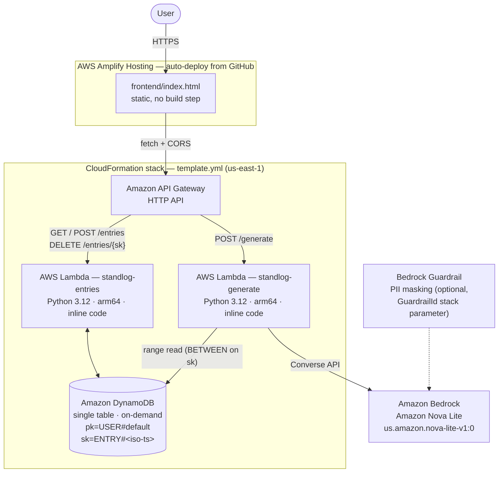

# StandLog — AI Work Journal / Standup Generator

Log terse work notes during the day. One click turns them into a **daily standup**,
a **weekly summary**, or a **client-ready ticket reply** — drafted by **Amazon Nova Lite on
Amazon Bedrock**, grounded strictly in what you actually logged.

One CloudFormation template. No SAM CLI, no build step, no packaging.

## Architecture



**Why these choices**
- **Pure CloudFormation, inline Lambda code** — the entire backend deploys from one
  `template.yml` uploaded in the console. Nothing to package, nothing to install.
- **HTTP API over REST API** — ~70% cheaper, sufficient for this traffic shape.
- **Single-table DynamoDB** — `pk=USER#default`, `sk=ENTRY#<iso-ts>#<id>` gives free
  chronological range queries by date with no GSI.
- **Bedrock Converse API** — model-agnostic; Amazon Nova Lite is just a parameter
  (`us.amazon.nova-lite-v1:0`), swap models without touching code.
- **arm64 Lambdas** — cheaper per ms, no code changes needed.

## Deploy (us-east-1)

1. **Enable model access**: Bedrock console (us-east-1) → *Model access* →
   enable **Amazon Nova Lite**.
2. **Deploy the stack**: CloudFormation console (us-east-1) → *Create stack* →
   *Upload a template file* → select `template.yml` → Next → Next →
   acknowledge IAM capabilities → *Create stack*.
3. **Grab the API URL** from the stack's **Outputs** tab (`ApiUrl`).
4. **Open `frontend/index.html`** in a browser → expand *API settings* →
   paste the URL → *Save endpoint*.

CLI alternative:

```bash
aws cloudformation deploy \
  --template-file template.yml \
  --stack-name standlog \
  --region us-east-1 \
  --capabilities CAPABILITY_IAM
```

### Host the frontend live with AWS Amplify

1. Push this repo to GitHub (public).
2. Amplify console (us-east-1) → **Create new app** → *Host web app* →
   connect GitHub → select this repo and branch.
3. Amplify picks up `amplify.yml` automatically (it serves the `frontend/`
   folder as a static site — no build step). Deploy.
4. Open the Amplify URL, paste the API URL in *API settings* once — or share a
   pre-configured link: `https://<your-app>.amplifyapp.com/?api=<ApiUrl>`.
5. Recommended: update the CloudFormation stack and set `CorsAllowOrigin` to
   your Amplify domain (e.g. `https://main.xxxx.amplifyapp.com`) instead of `*`.

> The Lambda source also lives in `backend/src/` as readable reference copies —
> **`template.yml` is the canonical, deployable version.**

## API

| Method | Path | Body / Params | Purpose |
|---|---|---|---|
| POST | `/entries` | `{text, kind: task\|blocker\|win\|note, tags: []}` | Log a note |
| GET | `/entries` | `?start=YYYY-MM-DD&end=YYYY-MM-DD` | List entries |
| DELETE | `/entries/{sk}` | — | Remove an entry |
| POST | `/generate` | `{mode: standup\|weekly\|ticket_reply, start, end, tag?, audience?}` | Draft output |

## Cost

Lambda + HTTP API + DynamoDB on-demand all sit inside the Free Tier at personal
usage. Nova Lite inference on Bedrock is metered per token and costs well under a
cent per generated report at this payload size.

## Bedrock Guardrails (optional, recommended)

The generate Lambda applies an Amazon Bedrock Guardrail when one is configured —
useful for masking PII (client names, emails) in generated ticket replies and
blocking off-topic content.

1. Bedrock console (us-east-1) → **Guardrails** → *Create guardrail* — enable
   the filters you want (sensitive-information/PII masking is the natural fit here).
2. Copy the **Guardrail ID**.
3. CloudFormation → your stack → **Update** → *Use existing template* → set the
   `GuardrailId` parameter (and `GuardrailVersion` — `DRAFT` while iterating,
   a published version number for stability).

That's it — no code change. If `GuardrailId` is empty, generation runs without
a guardrail. The API response includes `stop_reason`; the value
`guardrail_intervened` tells you the guardrail modified or blocked the output.

## Production hardening (out of weekend scope, on purpose)

- **Auth**: Cognito user pool + JWT authorizer; replace `USER#default` with the
  Cognito `sub` claim for multi-user support.
- **CORS**: set the `CorsAllowOrigin` parameter to your site URL instead of `*`.
- **Rate limiting**: throttling on the API stage; a WAF if public.
- **Observability**: Lambdas already log to CloudWatch; add alarms on errors.

## License

MIT — take it, rebuild it, submit your own.
